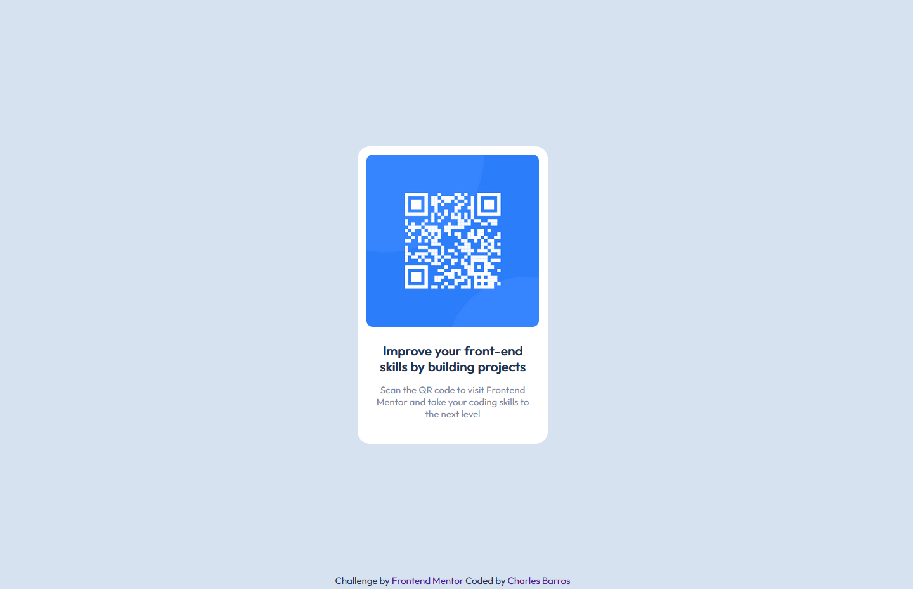

# Frontend Mentor | QR code component solution | Charles Barros

This is my solution to the [QR code component challenge on Frontend Mentor](https://www.frontendmentor.io/challenges/qr-code-component-iux_sIO_H). Frontend Mentor challenges help you improve your coding skills by building realistic projects. 

## Table of contents

- [Overview](#overview)
  - [The challenge](#the-challenge)
  - [Screenshot](#screenshot)
  - [Links](#links)
- [My process](#my-process)
  - [Built with](#built-with)
  - [What I learned](#what-i-learned)
  - [Continued development](#continued-development)
  - [Useful resources](#useful-resources)
- [Author](#author)
- [Acknowledgments](#acknowledgments)

## Overview

### The challenge
This is my proposal of solution to the QR code component challenge from Frontend Mentor website and my very first non-tutorial project in front-end carrer. 
The challenge consists of creating a simple static page using the jpg design file as reference and using only HTML5 and CSS3.

### Screenshot

### Links

- [Solution on Frontend Mentor](#)
- [Live at Versel](#)

## My process

### Built with
I started by configuring the project folder. Then build the entire structure and content in semantic HTML. Finally I finished with the customizations in CSS3, always iterating the HTML file to create and adjust the necessary classes.

### What I learned
This was my first non-tutorial Front-end project, so everything was a great learning experience, however, I emphasize that the alignment techniques both with Flexbox and with display block and also relative and absolute positions were great learnings in this challenge .

### Continued development
I intend to continue carrying out the challenges of the Frontend Mentor platform, especially those initial ones that only require HTML and CSS and strengthen my foundations in these languages, while I'm still learning the initial concepts of JavaScript.

### Useful resources
These two games below helped me a lot to understand how simple commands in Flexbox work, in addition to being very fun.
- [Flexbox Froggy](https://flexboxfroggy.com/) - Flexbox Froggy Game to practice Flexbox 
- [Flexbox Defense](http://www.flexboxdefense.com/) - Flexbox Defense Game to practice Flexbox 

## Author

- Linkedin - [Charles Barros](https://www.linkedin.com/in/charles-barros/)
- Frontend Mentor - [@charbavito](https://www.frontendmentor.io/profile/charbavito)
- Github - [Charles (charbavito) Barros](hhttps://github.com/charbavito)

## Acknowledgments

I thank the entire Frontend Mentor team for making this platform available with such useful and important content for those who are starting to venture into this Web Developer career. Thank you very much :)